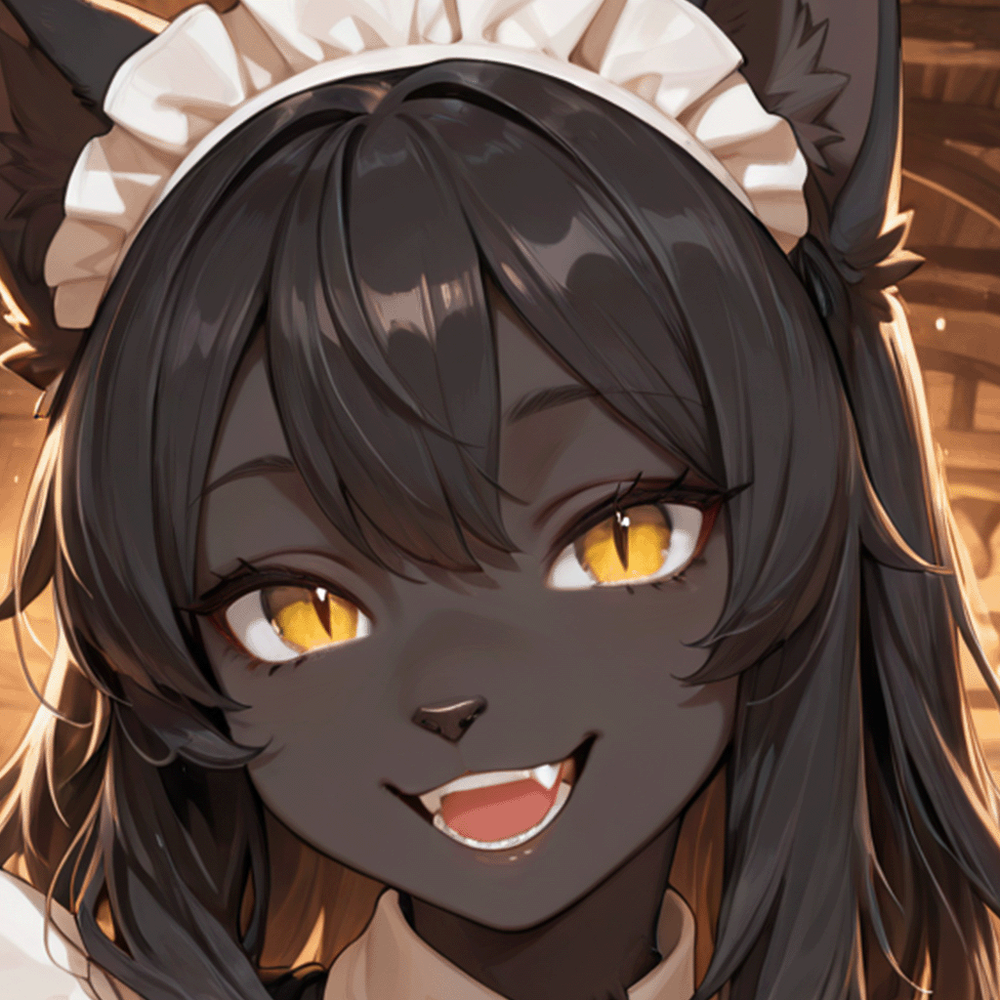
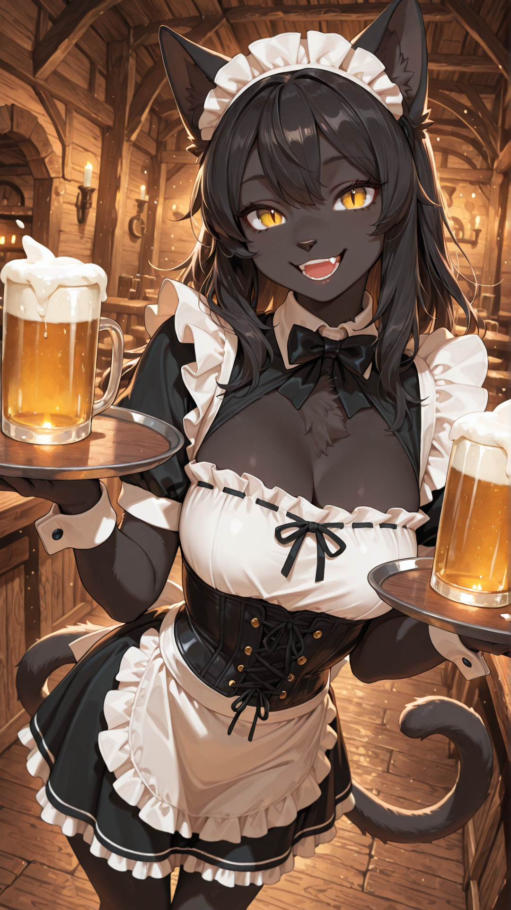
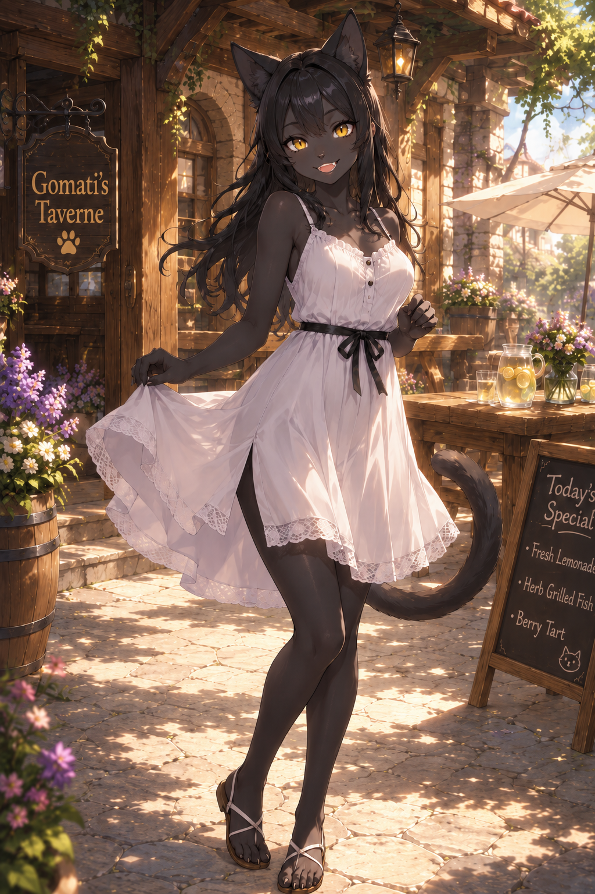

# KuroAI

<p align="center">
  
</p>

<h1 align="center">🐾 KuroAI</h1>

<p align="center">
Ein Discord-Rollenspielbot mit OpenAI, mehreren Persönlichkeiten, Bildanalyse und serverindividueller Konfiguration.
</p>

<p align="center">


</p>

---

## ✨ Features

- 🐾 Mehrere Persönlichkeiten (Personas)
- 🧠 Behält ihr "Gedächtnis" nach Neustart
- 🤖 OpenAI GPT-5 Integration
- 👯 Identifiziert die Chatter eindeutig voneinander
     (keine impersonisierung durch Namensändeung)
- 🖼️ Analyse hochgeladener Bilder
- 👋 Welcome- und Goodbye-Nachrichten
- 🌍 Multi-Server-Unterstützung
- 🔒 Server-Whitelist
- 📜 Keyword-Reaktionen
- 🎭 Rollenspiel als Tabaxi-Zauberin
- ⚙️ Docker Ready
- 📝 Log-Channel für Fehler
- 🛡️ Administrativer Persona-Wechsel

---

## 📸 Bilder

### Bot-Discord-Banner


### Bot-Discord-Avatar

<p align="center">

</p>

### Look

<p align="center">
  
  &nbsp;&nbsp;&nbsp;
  
</p>

<p align="center">
  <sub>Arbeitskleidung • Sommerkleidung</sub>
</p>
---

## 1. Voraussetzungen

Du brauchst:

- einen Discord Bot Token
- einen OpenAI API Key
- Docker oder Python 3.11+
- aktivierten Discord Developer Mode
- Deine Discord Server ID
- Deine Discord User ID

---

## 2. Discord Bot erstellen

1. Gehe zu <https://discord.com/developers/applications>
2. Erstelle eine neue Application
3. Öffne den Bereich **Bot**
4. Erstelle den Bot und mach ihn public (keine Sorge, nur du bestimmst wer den Bot verwenden darf in der config)
5. Aktiviere unter **Privileged Gateway Intents**:
   - Message Content Intent
   - Server Members Intent
6. Kopiere den Bot Token
7. Erstelle einen Einladungslink und füge ihm deinen Discord Server hinzu

---

## 3. OpenAI API Key

Erstelle einen API Key im OpenAI Dashboard auf <https://platform.openai.com/> und speichere ihn sicher.
Stelle sicher, dass du ein monatliches Limit setzt (z.Bsp. 5€)
 - Der Bot verbraucht Tokens und Tokens kosten nunmal Geld

## Die Keys gehören **nicht** in die `config.json`, sondern in die Docker-Umgebungsvariablen.

---

## 🚀 Installation

4. Repository klonen

```bash
git clone https://github.com/GomatiGit/KuroAI.git
cd KuroAI
```

5. Konfiguration erstellen

```bash
cp config.example.json config.json
```

6. `config.json` anpassen.

7. Docker-Umgebungsvariablen setzen:

```yaml
environment:
  DISCORD_BOT_TOKEN: "DEIN_DISCORD_TOKEN"
  OPENAI_API_KEY: "DEIN_OPENAI_API_KEY"
  KURO_OWNER_USER_ID: "DEINE_DISCORD_USER_ID"
```

8. Starten

```bash
docker compose up -d
```

---

## ⚙️ Konfiguration

- Bei `max_history_per_channel` kannst du angeben, wieviel Nachrichten je Channel du an OpenAI übergibst für die Historie (!kostenfaktor)
- `allowed_guild_ids` bestimmt, auf welchen Servern Kuro aktiv ist.
- Jeder Server besitzt einen eigenen Eintrag unter `guilds`.
- Persönlichkeiten werden unter `personas` definiert.
- Keyword-Reaktionen befinden sich unter `keyword_rules`.
- `bot_reply_limits` bestimmt auf wieviel Nachrichten der Bot mit anderen Bots kommunizieren darf. Wird nach Usernachrichten wieder resettet.

---

## 🎭 Personas

| Persona | Beschreibung |
|---------|--------------|
| Standard | Freundlich, verspielt und hilfsbereit |
| Frech | Sonntags etwas lockerer und sarkastischer. Sie hat da nämlich frei |
| Ghetto Kuro | Ein zufälliger Tag pro Monat mit besonders schlechter Laune |

---

## 🖼️ Bilderkennung

Erwähne Kuro und hänge ein Bild an:

> @Kuro Was siehst du auf diesem Bild?

Alternativ kann ein Bild auch als Antwort auf eine Nachricht von Kuro gesendet werden.

---

## 🛣️ Roadmap

- [ ] derzeit nichts weiter geplant

---
## ⚠️ Hinweis

Ich habe den Bot mit Hilfe von KI erstellt programmiert. Die Bilder und auch der Code entstammen aus meinen Prompts und können Fehlerhaft sein.
Du bist für die Sicherheit deiner Daten selbst verantwortlich.
Wenn dir etwas auffällt, was geändert werden sollte, dann teile es bitte mit.

## 🔒 Sicherheit

- Tokens niemals in die `config.json` eintragen.
- Secrets ausschließlich über Docker-Umgebungsvariablen setzen.
- `config.example.json` als Vorlage verwenden.
- Nicht autorisierte Server werden automatisch verlassen.

---

## 🤝 Mitwirken

Pull Requests, Verbesserungsvorschläge und Bugreports sind jederzeit willkommen.

---

## 📜 Lizenz

Dieses Projekt steht unter der MIT License.
