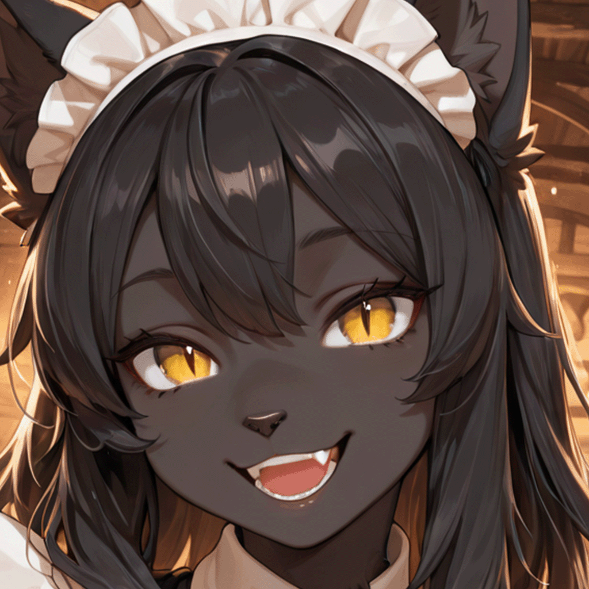
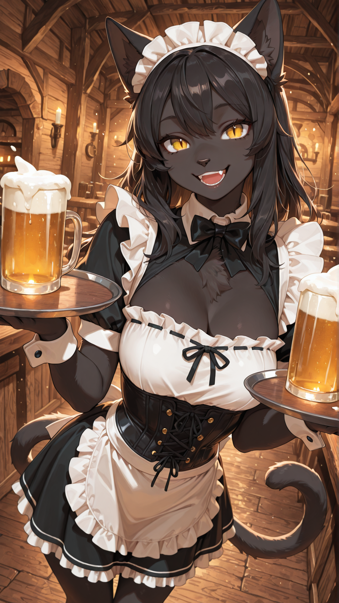
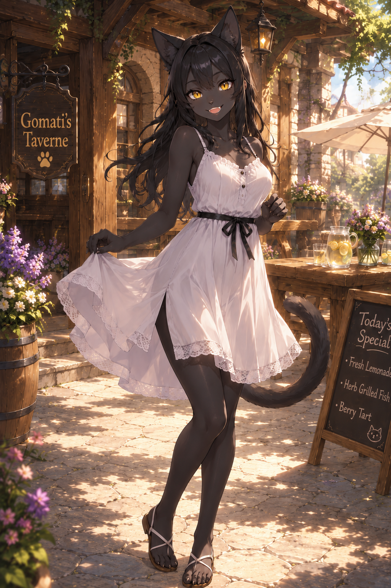

# KuroAI

<p align="center">
  
</p>

<h1 align="center">🐾 KuroAI</h1>

<p align="center">
Ein Discord-Rollenspiel-Bot mit OpenAI, mehreren Persönlichkeiten, Bildanalyse und serverindividueller Konfiguration.
</p>

<p align="center">


</p>

---

## ✨ Features

- 🐾 Mehrere Persönlichkeiten (Personas)
- 🧠 Persistenter Gesprächsverlauf über Neustarts hinweg
- 🤖 OpenAI-Integration mit konfigurierbarem Modell
- 👯 Eindeutige Identifikation der Chatter über ihre Discord-User-ID
- 🖼️ Analyse hochgeladener Bilder
- 🗣️ (optional) Sprachausgabe durch elevenlabs (in Entwicklung)
- 👋 Welcome- und Goodbye-Nachrichten
- 🌍 Multi-Server-Unterstützung
- 🔒 Server-Whitelist
- 📜 Keyword-Reaktionen
- 🎭 Rollenspiel als Tabaxi-Zauberin aus dem DnD Universum
- 🐳 Fertiges Docker-Image über GitHub Container Registry (GHCR)
- 📝 Log-Channel für Fehler
- 🛡️ Administrativer Persona-Wechsel / Chathistorie löschen / Befehl "/say" im Botkontext.

---

## 📸 Bilder

### Bot-Discord-Banner


### Bot-Discord-Avatar

<p align="center">

</p>

### Look

<p align="center">
  
  &nbsp;&nbsp;&nbsp;
  
</p>

<p align="center">
  <sub>Arbeitskleidung • Sommerkleidung</sub>
</p>

---

## 1. Voraussetzungen

Du brauchst:

- Docker Engine mit Docker Compose v2 oder Docker Desktop
- einen Discord Bot Token
- einen OpenAI API Key mit eingerichtetem Billing
- aktivierten Discord Developer Mode
- deine Discord Server-ID
- deine Discord User-ID
- Git zum Klonen des Repositories  
  alternativ kannst du das Repository als ZIP herunterladen

**Python muss auf dem Host nicht installiert sein.**  
Python und alle benötigten Bibliotheken sind bereits im Docker-Image enthalten.

Das fertige Image wird über die GitHub Container Registry bereitgestellt:

```text
ghcr.io/gomatigit/kuroai:latest
```

---

## 2. Discord Bot erstellen

1. Gehe zu <https://discord.com/developers/applications>
2. Erstelle eine neue Application.
3. Öffne den Bereich **Bot** und erstelle den Bot.
4. Aktiviere unter **Privileged Gateway Intents**:
   - Message Content Intent
   - Server Members Intent
5. Kopiere den Bot Token und speichere ihn sicher.
6. Erstelle unter **OAuth2** einen Einladungslink für den Bot und füge ihn deinem Discord-Server hinzu.
7. Aktiviere in Discord unter **Einstellungen → Erweitert** den **Entwicklermodus**.
8. Kopiere anschließend deine Discord User-ID und die Server-ID.

---

## 3. OpenAI API Key

Erstelle einen API Key im OpenAI Dashboard auf <https://platform.openai.com/> und speichere ihn sicher.

Es wird empfohlen, im OpenAI-Dashboard ein monatliches Budget bzw. Nutzungslimit festzulegen. Der Bot verwendet API-Tokens, wodurch Kosten entstehen.

**API Keys und Tokens gehören NIEMALS in die `config.json` und nicht in das Docker-Image.**  
Sie werden ausschließlich als Docker-Umgebungsvariablen bereitgestellt.

---

## 🚀 Installation

### 4. Repository herunterladen

Das Repository wird für `docker-compose.yml`, `.env.example` und `config.example.json` benötigt. Der eigentliche Bot wird anschließend als fertiges Docker-Image von GHCR geladen.

```bash
git clone https://github.com/GomatiGit/KuroAI.git
cd KuroAI
```

Alternativ kann das Repository über GitHub als ZIP heruntergeladen und entpackt werden.

### 5. Persistentes Datenverzeichnis erstellen

```bash
mkdir -p data
```

Kopiere anschließend die Beispielkonfiguration nach `data/config.json`:

```bash
cp config.example.json data/config.json
```

Unter Windows PowerShell:

```powershell
New-Item -ItemType Directory -Force data
Copy-Item config.example.json data\config.json
```

Passe danach `data/config.json` an deinen Discord-Server und deine gewünschten Personas an.

Der Ordner `data/` ist das persistente Datenverzeichnis von Kuro und wird nicht in das Docker-Image eingebaut.

Dort befinden sich später beispielsweise:

```text
data/
├── config.json
├── conversation_history.json
├── known_members.json
├── ghetto_day.json
├── mode_override.json
└── .avatar_applied
```

Die Laufzeitdateien werden vom Bot bei Bedarf angelegt bzw. aktualisiert.

### 6. Umgebungsvariablen einrichten

Erstelle aus der Vorlage eine lokale `.env`-Datei:

```bash
cp .env.example .env
```

Unter Windows PowerShell:

```powershell
Copy-Item .env.example .env
```

Trage dort mindestens deine eigenen Werte ein:

```env
DISCORD_BOT_TOKEN=dein_discord_bot_token
OPENAI_API_KEY=dein_openai_api_key
KURO_OWNER_USER_ID=deine_discord_user_id
```

Die folgenden Variablen sind für die geplante ElevenLabs-Sprachausgabe vorgesehen und im aktuellen Grundbetrieb nicht erforderlich:

```env
ELEVENLABS_API_KEY=
KURO_VOICE_ID=
```

Die Datei `.env` ist in `.gitignore` ausgeschlossen und darf nicht veröffentlicht werden.

Alternativ können die Variablen direkt in der jeweiligen Docker-, NAS- oder Container-Verwaltung gesetzt werden. Auf TrueNAS SCALE können sie beispielsweise über die Environment-Variablen der App bzw. des Containers hinterlegt werden.

### 7. Konfiguration anpassen

Öffne:

```text
data/config.json
```

und passe mindestens die Server- und Persona-Einstellungen an deine Umgebung an.

Wichtige Bereiche:

- `allowed_guild_ids` bestimmt, auf welchen Discord-Servern Kuro aktiv sein darf.
- Unter `guilds` können serverindividuelle Einstellungen hinterlegt werden.
- Unter `personas` werden die verschiedenen Persönlichkeiten definiert.
- `keyword_rules` enthält Keyword-Reaktionen.
- `max_history_per_channel` bestimmt, wie viele Nachrichten je Channel an OpenAI als Gesprächskontext übergeben werden. Ein höherer Wert kann die API-Kosten erhöhen.
- `bot_reply_limits` begrenzt, wie häufig Kuro mit anderen Bots kommunizieren darf, falls du noch andere Textbots hast, die auf Nachrichten reagieren.

### 8. Kuro starten

Zuerst das aktuelle Image laden:

```bash
docker compose pull
```

Danach Kuro starten:

```bash
docker compose up -d
```

Das Repository wird dabei nicht lokal als Anwendung ausgeführt. Docker verwendet das veröffentlichte Image:

```text
ghcr.io/gomatigit/kuroai:latest
```

Die lokale `data/`-Struktur wird in den Container unter `/app/data` eingebunden und bleibt deshalb auch beim Austausch oder Update des Containers erhalten.

### 9. Logs anzeigen

```bash
docker compose logs -f kuroai
```

Beenden mit:

```text
Ctrl+C
```

Der Container selbst läuft dabei weiter.

### 10. Kuro aktualisieren

Neue Versionen können ohne Neuinstallation übernommen werden:

```bash
docker compose pull
docker compose up -d
```

Das Docker-Image wird aktualisiert, während die Inhalte des lokalen `data/`-Ordners erhalten bleiben.

---

## ⚙️ Daten- und Containerstruktur

Kuro trennt bewusst Programmcode, Secrets und persistente Daten voneinander:

```text
GitHub / GHCR
├── Bot-Code
├── Python-Laufzeit
├── benötigte Bibliotheken
└── Assets

Docker-Umgebung
├── DISCORD_BOT_TOKEN
├── OPENAI_API_KEY
└── KURO_OWNER_USER_ID

Persistentes data/
├── config.json
├── conversation_history.json
├── known_members.json
├── ghetto_day.json
├── mode_override.json
└── .avatar_applied
```

Dadurch kann das Docker-Image aktualisiert oder vollständig ersetzt werden, ohne die individuelle Konfiguration oder den gespeicherten Zustand von Kuro zu verlieren.

Das Image enthält **keine persönlichen API Keys, Tokens oder Server-Konfigurationen**.

---

## 🎭 Personas

| Persona | Beschreibung |
|---------|--------------|
| Standard | Freundlich, verspielt und hilfsbereit |
| Frech | Sonntags etwas lockerer und sarkastischer. Sie hat da nämlich frei |
| Ghetto Kuro | Ein zufälliger Tag pro Monat mit besonders schlechter Laune |

---

## 🖼️ Bilderkennung

Erwähne Kuro und hänge ein Bild an:

> @Kuro Was siehst du auf diesem Bild?

Alternativ kann ein Bild auch als Antwort auf eine Nachricht von Kuro gesendet werden.

---

## 🛣️ Roadmap

- [ ] Optionale ElevenLabs-Sprachausgabe
- [ ] Bessere Personalisierung unterteilt nach einzelnen Discord Servern/Guilds

---

## ⚠️ Hinweis

Ich habe den Bot mit Hilfe von KI erstellt und programmiert. Die Bilder und auch Teile des Codes sind aus meinen Prompts entstanden und können Fehler enthalten.

Du bist für die Sicherheit deiner Zugangsdaten, deiner Konfiguration und deines Systems selbst verantwortlich.

Wenn dir ein Fehler oder eine sinnvolle Verbesserung auffällt, kannst du gerne ein Issue oder einen Pull Request erstellen.

---

## 🔒 Sicherheit

- Tokens und API Keys niemals in `config.json` eintragen.
- Secrets ausschließlich als Docker-Umgebungsvariablen oder über eine lokale `.env`-Datei setzen.
- `.env` niemals committen oder veröffentlichen.
- Der lokale `data/`-Ordner wird nicht in das Docker-Image eingebaut und sollte nicht ins Repository committed werden.
- `config.example.json` und `.env.example` sind ausschließlich Vorlagen und enthalten keine echten Zugangsdaten.
- Das veröffentlichte Docker-Image enthält keine persönlichen Secrets.
- Nicht autorisierte Discord-Server werden automatisch verlassen.
- API Keys sollten nach Möglichkeit mit passenden Berechtigungen und Nutzungslimits versehen werden.

---

## 🤝 Mitwirken

Pull Requests, Verbesserungsvorschläge und Bugreports sind jederzeit willkommen.

---

## 👤 Autor

KuroAI wurde von **GomatiGit** erstellt.

Dieses Projekt steht unter der MIT-Lizenz. Bei Weiterverwendung des Codes muss der enthaltene Copyright- und Lizenzhinweis erhalten bleiben.

---

## 📜 Lizenz

Copyright (c) 2026 GomatiGit
